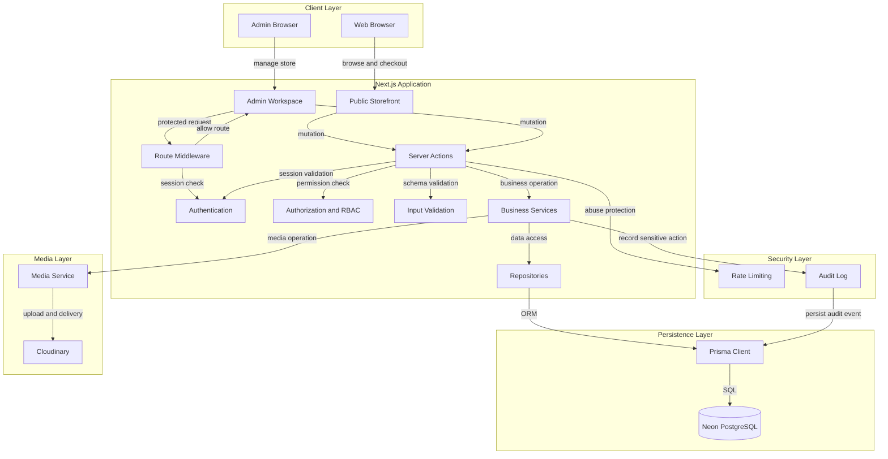
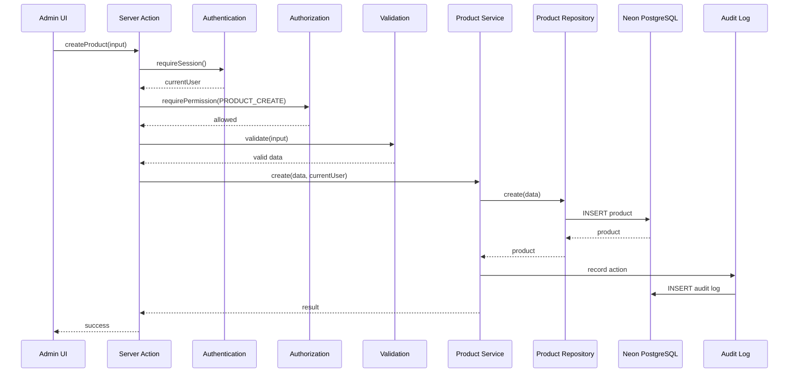
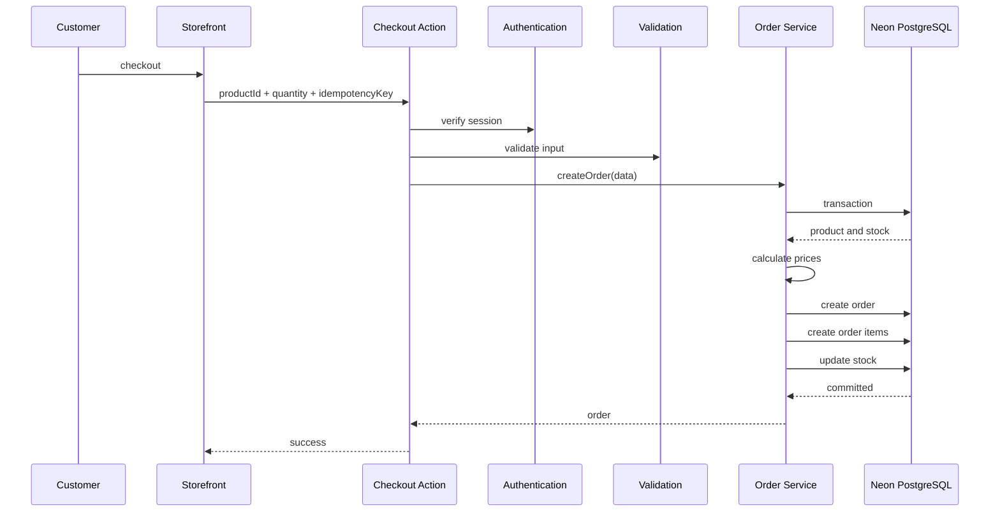

Oui. Je te propose de corriger l’architecture **sans la rendre inutilement complexe**. L’idée est de conserver Next.js + Server Actions + Prisma + Neon + Cloudinary, tout en ajoutant les vraies frontières de sécurité et les règles métier.


## Architecture corrigée


La règle centrale devient :


**UI → Server Action → Auth → Authorization → Validation → Business Service → Repository/Prisma → Database**


Le frontend ne doit jamais être considéré comme une couche de sécurité.





## Pourquoi cette version est meilleure


### 1. Middleware ne fait pas toute la sécurité


Le Middleware sert principalement à empêcher l'accès aux routes protégées.


Par exemple :


```text

/admin

/admin/products

/admin/orders

/super-admin

```


Mais une Server Action doit refaire les contrôles.


Donc :


```text

Middleware

    ↓

protection de navigation


Server Action

    ↓

protection réelle de l'opération

```


---


# 2. La bonne architecture des Server Actions


Au lieu de faire :


```text

Server Action

    ↓

Prisma

```


fais :


```text

Server Action

    ↓

Authentication

    ↓

Authorization

    ↓

Validation

    ↓

Business Service

    ↓

Repository

    ↓

Prisma

```


Exemple conceptuel :


```text

createProduct

      ↓

requireSession

      ↓

requirePermission

      ↓

validateCreateProduct

      ↓

productService.create

      ↓

productRepository.create

      ↓

Prisma

```


C'est beaucoup plus propre et beaucoup plus difficile à contourner.


---


# 3. Séparer Authentication et Authorization


Il faut clairement distinguer les deux.


### Authentication


Répond à :


> Qui es-tu ?


```text

JWT / Session

      ↓

userId

```


### Authorization


Répond à :


> As-tu le droit de faire ça ?


```text

userId

   ↓

database

   ↓

role / permissions

```


Par exemple :


```text

ADMIN

    ↓

PRODUCT_CREATE

PRODUCT_UPDATE

ORDER_READ


SUPER_ADMIN

    ↓

STAFF_MANAGE

SETTINGS_MANAGE

SECURITY_MANAGE

```


Ne fais pas confiance uniquement au rôle contenu dans le JWT pour une opération sensible.


---


# 4. Utiliser des permissions plutôt qu'un simple rôle partout


Ton système peut garder :


```text

CLIENT

ADMIN

SUPER_ADMIN

```


mais derrière, utilise des permissions.


Par exemple :


```text

PRODUCT_READ

PRODUCT_CREATE

PRODUCT_UPDATE

PRODUCT_DELETE


CATEGORY_CREATE

CATEGORY_UPDATE

CATEGORY_DELETE


ORDER_READ

ORDER_UPDATE


CLIENT_READ


STAFF_READ

STAFF_CREATE

STAFF_UPDATE

STAFF_DELETE


SETTINGS_READ

SETTINGS_UPDATE

```


Le rôle sert alors à déterminer les permissions.


```text

SUPER_ADMIN

     ↓

toutes les permissions


ADMIN

     ↓

permissions administratives autorisées


CLIENT

     ↓

permissions client

```


Cela t'évitera d'avoir partout :


```ts

if (user.role === "ADMIN")

```


---


# 5. Ajouter une vraie couche Business Service


C'est probablement le changement architectural le plus important.


Tes Server Actions ne doivent pas contenir toute la logique.


### Mauvaise organisation


```text

createProduct()

    ↓

validation

    ↓

calcul

    ↓

Prisma

    ↓

Cloudinary

    ↓

revalidatePath

```


### Bonne organisation


```text

createProductAction()

        ↓

requirePermission()

        ↓

validateInput()

        ↓

productService.create()

             ↓

       productRepository

             ↓

           Prisma

```


Ainsi la logique métier reste indépendante de l'interface.


---


# 6. Ajouter Repository


Je te conseille cette organisation :


```text

repositories/

    product.repository.ts

    category.repository.ts

    order.repository.ts

    user.repository.ts

    staff.repository.ts

```


Le repository s'occupe de :


```text

find

findMany

create

update

delete

```


mais pas des règles métier complexes.


Par exemple :


```text

ProductRepository

        ↓

Prisma

```


Le service décide :


```text

est-ce autorisé ?

quel prix ?

stock disponible ?

quel statut ?

quelle règle métier ?

```


---


# 7. Gestion correcte du prix


Pour une boutique, c'est essentiel.


Ne fais jamais confiance à :


```text

price envoyé par le navigateur

```


Le client doit envoyer quelque chose comme :


```text

productId

quantity

```


Puis le serveur fait :


```text

productId

    ↓

Database

    ↓

prix réel

    ↓

calcul total

    ↓

création commande

```


Donc :


```text

Frontend

    ↓

productId + quantity

```


et non :


```text

Frontend

    ↓

productId + quantity + price

```


---


# 8. Gestion correcte du stock


Le stock doit être géré dans une transaction ou par une mise à jour atomique.


Architecture :


```text

Create Order

     ↓

Transaction

     ├── verify stock

     ├── calculate price

     ├── create order

     ├── create order items

     └── decrement stock

```


Cela évite notamment :


```text

Stock = 1


Client A ──┐

           ├── achat simultané

Client B ──┘

```


qui pourrait provoquer une vente supérieure au stock disponible.


---


# 9. Ajouter Idempotency pour les commandes


Pour éviter :


```text

double click

refresh

retry réseau

```


qui créeraient deux commandes, ajoute un mécanisme d'idempotence.


Par exemple :


```text

checkout

   ↓

idempotencyKey

   ↓

server

   ↓

si déjà traité

   ↓

retourner la commande existante

```


C'est particulièrement utile lors du checkout.


---


# 10. Cloudinary doit avoir sa propre couche


Actuellement :


```text

Admin → Cloudinary

```


Je recommande :


```text

Admin

  ↓

Server Action

  ↓

Authorization

  ↓

Validation

  ↓

Media Service

  ↓

Cloudinary

```


Le `MediaService` pourra gérer :


```text

upload

delete

replace

folder

size

format

secure URL

public ID

```


Et tu conserves en base uniquement les informations nécessaires.


Par exemple :


```text

Product

 ├── imageUrl

 └── cloudinaryPublicId

```


Le `publicId` devient utile pour supprimer/remplacer proprement une image.


---


# 11. Ajouter Rate Limiting


Je l'ajouterais comme infrastructure transversale :


```text

login

register

checkout

forgot password

admin actions

upload

```


Architecture :


```text

Server Action

     ↓

Rate Limit

     ↓

Authorization

     ↓

Action

```


Le but est notamment de limiter les tentatives automatisées.


---


# 12. Ajouter Audit Log


Pour les actions administratives :


```text

create product

update product

delete product

change price

create staff

delete staff

change permissions

change settings

```


tu devrais enregistrer :


```text

actorId

action

resource

resourceId

timestamp

metadata

```


Exemple :


```text

AuditLog


actorId: 42

action: PRODUCT_PRICE_UPDATED

resource: Product

resourceId: 18

timestamp: ...

```


Cela donne une vraie traçabilité.


---


# 13. Architecture des dossiers


Je te conseille une structure simple mais solide, sans aller jusqu'au DDD lourd :


```text

src/

│

├── app/

│   ├── (storefront)/

│   │   ├── page.tsx

│   │   ├── boutique/

│   │   ├── collections/

│   │   ├── produits/

│   │   ├── panier/

│   │   ├── checkout/

│   │   └── compte/

│   │

│   ├── (admin)/

│   │   └── admin/

│   │

│   ├── (super-admin)/

│   │   └── super-admin/

│   │

│   └── api/

│

├── modules/

│   │

│   ├── product/

│   │   ├── actions/

│   │   ├── services/

│   │   ├── repositories/

│   │   ├── validators/

│   │   ├── dto/

│   │   └── types/

│   │

│   ├── category/

│   ├── order/

│   ├── user/

│   ├── staff/

│   ├── auth/

│   ├── media/

│   ├── settings/

│   └── audit/

│

├── infrastructure/

│   ├── prisma/

│   ├── cloudinary/

│   ├── auth/

│   ├── rate-limit/

│   └── audit/

│

├── shared/

│   ├── components/

│   ├── constants/

│   ├── errors/

│   ├── utils/

│   └── types/

│

└── middleware.ts

```


---


# 14. Flux réel pour Product


Voici le flux que je recommande :





---


# 15. Flux Checkout





---


# 16. Une correction importante de ton diagramme actuel


Tu avais :


```text

PublicUI --> ProductActions

Checkout --> ProductActions

```


Cela mélange les responsabilités.


Il vaut mieux :


```text

PublicUI

   ↓

Product queries


Checkout

   ↓

Order Actions

   ↓

Order Service

```


Donc :


```text

Product

Category

Order

Client

Staff

Auth

Settings

```


doivent avoir leurs propres modules métier.


Par exemple :


```text

product/

category/

order/

customer/

staff/

auth/

settings/

media/

audit/

```


---


# Architecture finale recommandée


```text

                         CLIENT

                            │

             ┌──────────────┴──────────────┐

             │                             │

         Storefront                    Admin UI

             │                             │

             └──────────────┬──────────────┘

                            │

                     Server Actions

                            │

                  ┌─────────▼─────────┐

                  │ Authentication    │

                  └─────────┬─────────┘

                            │

                  ┌─────────▼─────────┐

                  │ Authorization     │

                  │ RBAC / Permission │

                  └─────────┬─────────┘

                            │

                  ┌─────────▼─────────┐

                  │ Validation        │

                  │ DTO / Schema      │

                  └─────────┬─────────┘

                            │

                  ┌─────────▼─────────┐

                  │ Business Service  │

                  └───────┬─────┬─────┘

                          │     │

                 ┌────────▼┐   └─────────────┐

                 │Repository│                │

                 └─────┬────┘          ┌─────▼─────┐

                       │                │ Media      │

                 ┌─────▼─────┐         │ Service    │

                 │  Prisma   │         └─────┬──────┘

                 └─────┬─────┘               │

                       │                 Cloudinary

                 ┌─────▼─────┐

                 │   Neon    │

                 └───────────┘


       Transverse Security

       ├── Rate Limiting

       ├── Audit Logs

       ├── Secure Session

       └── Error Handling

```


### Ce que je changerais concrètement dans Bushra


Ton architecture actuelle peut donc évoluer de :


```text

Pages

  ↓

Server Actions

  ↓

Prisma

  ↓

Neon

```


vers :


```text

Pages

  ↓

Server Actions

  ↓

Auth

  ↓

RBAC

  ↓

Validation

  ↓

Services

  ↓

Repositories

  ↓

Prisma

  ↓

Neon

```


avec, en parallèle :


```text

Services → Media Service → Cloudinary

Services → Audit Log

Server Actions → Rate Limiting

```


C'est cette version que je considérerais comme la **bonne base de production pour Bushra**, tout en restant raisonnablement simple à maintenir.

